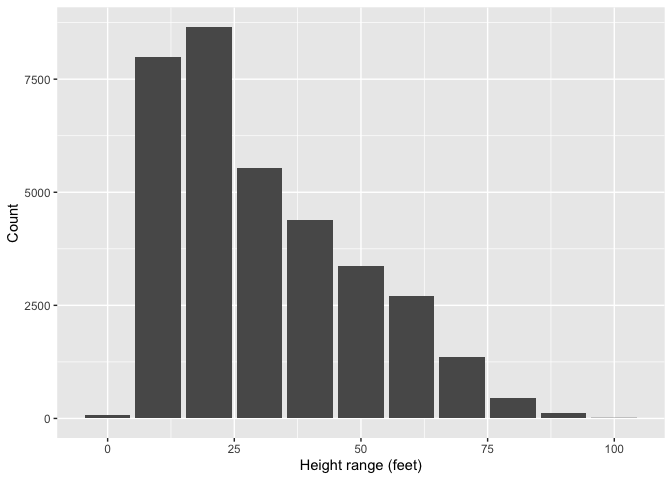
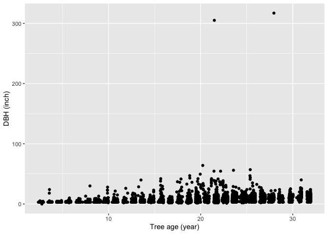
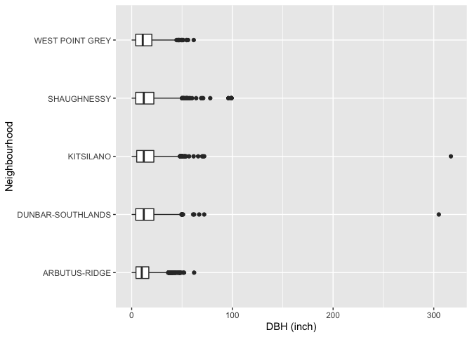

Mini Data-Analysis Deliverable 1
================
Tzu-Yi Lu,
2021 Oct 08

# Welcome to your (maybe) first-ever data analysis project\!

And hopefully the first of many. Let’s get started:

1.  Install the [`datateachr`](https://github.com/UBC-MDS/datateachr)
    package by typing the following into your **R terminal**:

<!-- end list -->

``` r
# Comment out the installation commands.

# install.packages("devtools")
# devtools::install_github("UBC-MDS/datateachr")
```

2.  Load the packages below.

<!-- end list -->

``` r
library(datateachr)
library(tidyverse)
```

    ## ── Attaching packages ─────────────────────────────────────── tidyverse 1.3.1 ──

    ## ✓ ggplot2 3.3.5     ✓ purrr   0.3.4
    ## ✓ tibble  3.1.5     ✓ dplyr   1.0.7
    ## ✓ tidyr   1.1.4     ✓ stringr 1.4.0
    ## ✓ readr   2.0.2     ✓ forcats 0.5.1

    ## ── Conflicts ────────────────────────────────────────── tidyverse_conflicts() ──
    ## x dplyr::filter() masks stats::filter()
    ## x dplyr::lag()    masks stats::lag()

3.  Make a repository in the <https://github.com/stat545ubc-2021>
    Organization. You will be working with this repository for the
    entire data analysis project. You can either make it public, or make
    it private and add the TA’s and Vincenzo as collaborators.

4.  When you go to submit, submit a URL to your repository to canvas.

# Instructions

More details regarding the instructions and points allocated to each
task can be found below. Briefly,

  - Each milestone is worth 30 points. The number of points allocated to
    each task will be annotated within each deliverable. Tasks that are
    more challenging will often be allocated more points.

  - 10 points will be allocated to the reproducibility, cleanliness, and
    coherence of the analysis. While the three milestones will be
    submitted as independent deliverables, the analysis itself is a
    continuum - think of it as 3 chapters to a story. Each chapter, or
    in this case, portion of your analysis, should be easily followed
    through by someone unfamiliar with the content.
    [Here](https://swcarpentry.github.io/r-novice-inflammation/06-best-practices-R/)
    is a good resource for what constitutes “good code”. Learning good
    coding practices early in your career will save you hassle later
    on\!

# Learning Objectives

By the end of this milestone, you should:

  - Become familiar with your dataset of choosing
  - Think of 4 questions that you would like to answer with your data
  - Generate a reproducible and clear report using R Markdown

# Task 1: Choose your favorite dataset (10 points)

The `datateachr` package by Hayley Boyce and Jordan Bourak currently
composed of 7 semi-tidy datasets for educational purposes. Here is a
brief description of each dataset:

  - *apt\_buildings*: Acquired courtesy of The City of Toronto’s Open
    Data Portal. It currently has 3455 rows and 37 columns.

  - *building\_permits*: Acquired courtesy of The City of Vancouver’s
    Open Data Portal. It currently has 20680 rows and 14 columns.

  - *cancer\_sample*: Acquired courtesy of UCI Machine Learning
    Repository. It currently has 569 rows and 32 columns.

  - *flow\_sample*: Acquired courtesy of The Government of Canada’s
    Historical Hydrometric Database. It currently has 218 rows and 7
    columns.

  - *parking\_meters*: Acquired courtesy of The City of Vancouver’s Open
    Data Portal. It currently has 10032 rows and 22 columns.

  - *steam\_games*: Acquired courtesy of Kaggle. It currently has 40833
    rows and 21 columns.

  - *vancouver\_trees*: Acquired courtesy of The City of Vancouver’s
    Open Data Portal. It currently has 146611 rows and 20 columns.

**Things to keep in mind**

  - We hope that this project will serve as practice for carrying our
    your own *independent* data analysis. Remember to comment your code,
    be explicit about what you are doing, and write notes in this
    markdown document when you feel that context is required. As you
    advance in the project, prompts and hints to do this will be
    diminished - it’ll be up to you\!

  - Before choosing a dataset, you should always keep in mind **your
    goal**, or in other ways, *what you wish to achieve with this data*.
    This mini data-analysis project focuses on *data wrangling*,
    *tidying*, and *visualization*. In short, it’s a way for you to get
    your feet wet with exploring data on your own.

And that is exactly the first thing that you will do\!

1.1 Out of the 7 datasets available in the `datateachr` package, choose
**4** that appeal to you based on their description. Write your choices
below:

**Note**: We encourage you to use the ones in the `datateachr` package,
but if you have a dataset that you’d really like to use, you can include
it here. But, please check with a member of the teaching team to see
whether the dataset is of appropriate complexity. Also, include a
**brief** description of the dataset here to help the teaching team
understand your data.

1: apt\_buildings  
2: parking\_meters  
3: steam\_games  
4: vancouver\_trees

1.2 One way to narrowing down your selection is to *explore* the
datasets. Use your knowledge of dplyr to find out at least *3*
attributes about each of these datasets (an attribute is something such
as number of rows, variables, class type…). The goal here is to have an
idea of *what the data looks like*.

*Hint:* This is one of those times when you should think about the
cleanliness of your analysis. I added a single code chunk for you, but
do you want to use more than one? Would you like to write more comments
outside of the code chunk?

``` r
### EXPLORE HERE ###
steam_games
```

    ## # A tibble: 40,833 × 21
    ##       id url    types name  desc_snippet recent_reviews all_reviews release_date
    ##    <dbl> <chr>  <chr> <chr> <chr>        <chr>          <chr>       <chr>       
    ##  1     1 https… app   DOOM  Now include… Very Positive… Very Posit… May 12, 2016
    ##  2     2 https… app   PLAY… PLAYERUNKNO… Mixed,(6,214)… Mixed,(836… Dec 21, 2017
    ##  3     3 https… app   BATT… Take comman… Mixed,(166),-… Mostly Pos… Apr 24, 2018
    ##  4     4 https… app   DayZ  The post-so… Mixed,(932),-… Mixed,(167… Dec 13, 2018
    ##  5     5 https… app   EVE … EVE Online … Mixed,(287),-… Mostly Pos… May 6, 2003 
    ##  6     6 https… bund… Gran… Grand Theft… NaN            NaN         NaN         
    ##  7     7 https… app   Devi… The ultimat… Very Positive… Very Posit… Mar 7, 2019 
    ##  8     8 https… app   Huma… Human: Fall… Very Positive… Very Posit… Jul 22, 2016
    ##  9     9 https… app   They… They Are Bi… Very Positive… Very Posit… Dec 12, 2017
    ## 10    10 https… app   Warh… In a world … <NA>           Mixed,(904… May 31, 2019
    ## # … with 40,823 more rows, and 13 more variables: developer <chr>,
    ## #   publisher <chr>, popular_tags <chr>, game_details <chr>, languages <chr>,
    ## #   achievements <dbl>, genre <chr>, game_description <chr>,
    ## #   mature_content <chr>, minimum_requirements <chr>,
    ## #   recommended_requirements <chr>, original_price <dbl>, discount_price <dbl>

1.3 Now that you’ve explored the 4 datasets that you were initially most
interested in, let’s narrow it down to 2. What lead you to choose these
2? Briefly explain your choices below, and feel free to include any code
in your explanation.

1.4 Time for the final decision\! Going back to the beginning, it’s
important to have an *end goal* in mind. For example, if I had chosen
the `titanic` dataset for my project, I might’ve wanted to explore the
relationship between survival and other variables. Try to think of 1
research question that you would want to answer with each dataset. Note
them down below, and make your final choice based on what seems more
interesting to you\!

# Important note

Read Tasks 2 and 3 *fully* before starting to complete either of them.
Probably also a good point to grab a coffee to get ready for the fun
part\!

This project is semi-guided, but meant to be *independent*. For this
reason, you will complete tasks 2 and 3 below (under the **START HERE**
mark) as if you were writing your own exploratory data analysis report,
and this guidance never existed\! Feel free to add a brief introduction
section to your project, format the document with markdown syntax as you
deem appropriate, and structure the analysis as you deem appropriate.
Remember, marks will be awarded for completion of the 4 tasks, but 10
points of the whole project are allocated to a reproducible and clean
analysis. If you feel lost, you can find a sample data analysis
[here](https://www.kaggle.com/headsortails/tidy-titarnic) to have a
better idea. However, bear in mind that it is **just an example** and
you will not be required to have that level of complexity in your
project.

# Task 2: Exploring your dataset (15 points)

If we rewind and go back to the learning objectives, you’ll see that by
the end of this deliverable, you should have formulated *4* research
questions about your data that you may want to answer during your
project. However, it may be handy to do some more exploration on your
dataset of choice before creating these questions - by looking at the
data, you may get more ideas. **Before you start this task, read all
instructions carefully until you reach START HERE**.

2.1 Complete *4 out of the following 8 exercises* to dive deeper into
your data. All datasets are different and therefore, not all of these
tasks may make sense for your data - which is why you should only answer
*4*. Use *dplyr* and *ggplot*.

1.  Plot the distribution of a numeric variable.
2.  Create a new variable based on other variables in your data (only if
    it makes sense)
3.  Investigate how many missing values there are per variable. Can you
    find a way to plot this?
4.  Explore the relationship between 2 variables in a plot.
5.  Filter observations in your data according to your own criteria.
    Think of what you’d like to explore - again, if this was the
    `titanic` dataset, I may want to narrow my search down to passengers
    born in a particular year…
6.  Use a boxplot to look at the frequency of different observations
    within a single variable. You can do this for more than one variable
    if you wish\!
7.  Make a new tibble with a subset of your data, with variables and
    observations that you are interested in exploring.
8.  Use a density plot to explore any of your variables (that are
    suitable for this type of plot).

2.2 For each of the 4 exercises that you complete, provide a *brief
explanation* of why you chose that exercise in relation to your data (in
other words, why does it make sense to do that?), and sufficient
comments for a reader to understand your reasoning and code.

# Task 3: Write your research questions (5 points)

So far, you have chosen a dataset and gotten familiar with it through
exploring the data. Now it’s time to figure out 4 research questions
that you would like to answer with your data\! Write the 4 questions and
any additional comments at the end of this deliverable. These questions
are not necessarily set in stone - TAs will review them and give you
feedback; therefore, you may choose to pursue them as they are for the
rest of the project, or make modifications\!

<!--- *****START HERE***** --->

## Mini Data-Analysis Deliverable 1

``` r
# load all libraries needed in this script
library(datateachr)
library(tidyverse)
library(ggplot2)
```

### Q1.1: Choose 4 out of the 7 datasets available in the `datateachr` package.

(Q1.1) Answer:

I tried to understand the datasets by the descriptions in the
mini-project-1.Rmd on github
(<https://github.com/UBC-STAT/stat545.stat.ubc.ca/blob/master/content/mini-project/mini-project-1.Rmd>).
I also searched for the descriptions of variables from
“<https://rdrr.io/github/UBC-MDS/datateachr/f/>”. In each "R/\*.R"
file, I found sources of the data and then understood the meanings of
each variable by accessing the websites.

Here are my choices for Q1.1.

1: apt\_buildings  
2: parking\_meters  
3: steam\_games  
4: vancouver\_trees

### Q1.2: Use your knowledge of dplyr to find out at least *3* attributes about each of these datasets.

(Q1.2) Answer:

dim\_desc: return the numbers of rows and columns of each dataset.
glimpse: return numbers of row and column, variable types(double/char),
and part of the content of each variable.

``` r
# using "dim_desc" and "glimpse" functions to explore datasets.
dplyr::dim_desc(apt_buildings)
```

    ## [1] "[3,455 x 37]"

``` r
dplyr::glimpse(apt_buildings)
```

    ## Rows: 3,455
    ## Columns: 37
    ## $ id                               <dbl> 10359, 10360, 10361, 10362, 10363, 10…
    ## $ air_conditioning                 <chr> "NONE", "NONE", "NONE", "NONE", "NONE…
    ## $ amenities                        <chr> "Outdoor rec facilities", "Outdoor po…
    ## $ balconies                        <chr> "YES", "YES", "YES", "YES", "NO", "NO…
    ## $ barrier_free_accessibilty_entr   <chr> "YES", "NO", "NO", "YES", "NO", "NO",…
    ## $ bike_parking                     <chr> "0 indoor parking spots and 10 outdoo…
    ## $ exterior_fire_escape             <chr> "NO", "NO", "NO", "YES", "NO", NA, "N…
    ## $ fire_alarm                       <chr> "YES", "YES", "YES", "YES", "YES", "Y…
    ## $ garbage_chutes                   <chr> "YES", "YES", "NO", "NO", "NO", "NO",…
    ## $ heating_type                     <chr> "HOT WATER", "HOT WATER", "HOT WATER"…
    ## $ intercom                         <chr> "YES", "YES", "YES", "YES", "YES", "Y…
    ## $ laundry_room                     <chr> "YES", "YES", "YES", "YES", "YES", "Y…
    ## $ locker_or_storage_room           <chr> "NO", "YES", "YES", "YES", "NO", "YES…
    ## $ no_of_elevators                  <dbl> 3, 3, 0, 1, 0, 0, 0, 2, 4, 2, 0, 2, 2…
    ## $ parking_type                     <chr> "Underground Garage , Garage accessib…
    ## $ pets_allowed                     <chr> "YES", "YES", "YES", "YES", "YES", "Y…
    ## $ prop_management_company_name     <chr> NA, "SCHICKEDANZ BROS. PROPERTIES", N…
    ## $ property_type                    <chr> "PRIVATE", "PRIVATE", "PRIVATE", "PRI…
    ## $ rsn                              <dbl> 4154812, 4154815, 4155295, 4155309, 4…
    ## $ separate_gas_meters              <chr> "NO", "NO", "NO", "NO", "NO", "NO", "…
    ## $ separate_hydro_meters            <chr> "YES", "YES", "YES", "YES", "YES", "Y…
    ## $ separate_water_meters            <chr> "NO", "NO", "NO", "NO", "NO", "NO", "…
    ## $ site_address                     <chr> "65  FOREST MANOR RD", "70  CLIPPER R…
    ## $ sprinkler_system                 <chr> "YES", "YES", "NO", "YES", "NO", "NO"…
    ## $ visitor_parking                  <chr> "PAID", "FREE", "UNAVAILABLE", "UNAVA…
    ## $ ward                             <chr> "17", "17", "03", "03", "02", "02", "…
    ## $ window_type                      <chr> "DOUBLE PANE", "DOUBLE PANE", "DOUBLE…
    ## $ year_built                       <dbl> 1967, 1970, 1927, 1959, 1943, 1952, 1…
    ## $ year_registered                  <dbl> 2017, 2017, 2017, 2017, 2017, NA, 201…
    ## $ no_of_storeys                    <dbl> 17, 14, 4, 5, 4, 4, 4, 7, 32, 4, 4, 7…
    ## $ emergency_power                  <chr> "NO", "YES", "NO", "NO", "NO", "NO", …
    ## $ `non-smoking_building`           <chr> "YES", "NO", "YES", "YES", "YES", "NO…
    ## $ no_of_units                      <dbl> 218, 206, 34, 42, 25, 34, 14, 105, 57…
    ## $ no_of_accessible_parking_spaces  <dbl> 8, 10, 20, 42, 12, 0, 5, 1, 1, 6, 12,…
    ## $ facilities_available             <chr> "Recycling bins", "Green Bin / Organi…
    ## $ cooling_room                     <chr> "NO", "NO", "NO", "NO", "NO", "NO", "…
    ## $ no_barrier_free_accessible_units <dbl> 2, 0, 0, 42, 0, NA, 14, 0, 0, 1, 25, …

``` r
dplyr::dim_desc(parking_meters)
```

    ## [1] "[10,032 x 22]"

``` r
dplyr::glimpse(parking_meters)
```

    ## Rows: 10,032
    ## Columns: 22
    ## $ meter_head     <chr> "Twin", "Pay Station", "Twin", "Single", "Twin", "Twin"…
    ## $ r_mf_9a_6p     <chr> "$2.00", "$1.00", "$1.00", "$1.00", "$2.00", "$2.00", "…
    ## $ r_mf_6p_10     <chr> "$4.00", "$1.00", "$1.00", "$1.00", "$1.00", "$1.00", "…
    ## $ r_sa_9a_6p     <chr> "$2.00", "$1.00", "$1.00", "$1.00", "$2.00", "$2.00", "…
    ## $ r_sa_6p_10     <chr> "$4.00", "$1.00", "$1.00", "$1.00", "$1.00", "$1.00", "…
    ## $ r_su_9a_6p     <chr> "$2.00", "$1.00", "$1.00", "$1.00", "$2.00", "$2.00", "…
    ## $ r_su_6p_10     <chr> "$4.00", "$1.00", "$1.00", "$1.00", "$1.00", "$1.00", "…
    ## $ rate_misc      <chr> NA, "$ .50", NA, NA, NA, NA, NA, NA, NA, NA, NA, NA, NA…
    ## $ time_in_effect <chr> "METER IN EFFECT: 9:00 AM TO 10:00 PM", "METER IN EFFEC…
    ## $ t_mf_9a_6p     <chr> "2 Hr", "10 Hrs", "2 Hr", "2 Hr", "2 Hr", "3 Hr", "2 Hr…
    ## $ t_mf_6p_10     <chr> "4 Hr", "10 Hrs", "4 Hr", "4 Hr", "4 Hr", "4 Hr", "4 Hr…
    ## $ t_sa_9a_6p     <chr> "2 Hr", "10 Hrs", "2 Hr", "2 Hr", "2 Hr", "3 Hr", "2 Hr…
    ## $ t_sa_6p_10     <chr> "4 Hr", "10 Hrs", "4 Hr", "4 Hr", "4 Hr", "4 Hr", "4 Hr…
    ## $ t_su_9a_6p     <chr> "2 Hr", "10 Hrs", "2 Hr", "2 Hr", "2 Hr", "3 Hr", "2 Hr…
    ## $ t_su_6p_10     <chr> "4 Hr", "10 Hrs", "4 Hr", "4 Hr", "4 Hr", "4 Hr", "4 Hr…
    ## $ time_misc      <chr> NA, "No Time Limit", NA, NA, NA, NA, NA, NA, NA, NA, NA…
    ## $ credit_card    <chr> "No", "Yes", "No", "No", "No", "No", "No", "No", "No", …
    ## $ pay_phone      <chr> "66890", "59916", "57042", "57159", "51104", "60868", "…
    ## $ longitude      <dbl> -123.1289, -123.0982, -123.1013, -123.1862, -123.1278, …
    ## $ latitude       <dbl> 49.28690, 49.27215, 49.25468, 49.26341, 49.26354, 49.27…
    ## $ geo_local_area <chr> "West End", "Strathcona", "Riley Park", "West Point Gre…
    ## $ meter_id       <chr> "670805", "471405", "C80145", "D03704", "301023", "5913…

``` r
dplyr::dim_desc(steam_games)
```

    ## [1] "[40,833 x 21]"

``` r
dplyr::glimpse(steam_games)
```

    ## Rows: 40,833
    ## Columns: 21
    ## $ id                       <dbl> 1, 2, 3, 4, 5, 6, 7, 8, 9, 10, 11, 12, 13, 14…
    ## $ url                      <chr> "https://store.steampowered.com/app/379720/DO…
    ## $ types                    <chr> "app", "app", "app", "app", "app", "bundle", …
    ## $ name                     <chr> "DOOM", "PLAYERUNKNOWN'S BATTLEGROUNDS", "BAT…
    ## $ desc_snippet             <chr> "Now includes all three premium DLC packs (Un…
    ## $ recent_reviews           <chr> "Very Positive,(554),- 89% of the 554 user re…
    ## $ all_reviews              <chr> "Very Positive,(42,550),- 92% of the 42,550 u…
    ## $ release_date             <chr> "May 12, 2016", "Dec 21, 2017", "Apr 24, 2018…
    ## $ developer                <chr> "id Software", "PUBG Corporation", "Harebrain…
    ## $ publisher                <chr> "Bethesda Softworks,Bethesda Softworks", "PUB…
    ## $ popular_tags             <chr> "FPS,Gore,Action,Demons,Shooter,First-Person,…
    ## $ game_details             <chr> "Single-player,Multi-player,Co-op,Steam Achie…
    ## $ languages                <chr> "English,French,Italian,German,Spanish - Spai…
    ## $ achievements             <dbl> 54, 37, 128, NA, NA, NA, 51, 55, 34, 43, 72, …
    ## $ genre                    <chr> "Action", "Action,Adventure,Massively Multipl…
    ## $ game_description         <chr> "About This Game Developed by id software, th…
    ## $ mature_content           <chr> NA, "Mature Content Description  The develope…
    ## $ minimum_requirements     <chr> "Minimum:,OS:,Windows 7/8.1/10 (64-bit versio…
    ## $ recommended_requirements <chr> "Recommended:,OS:,Windows 7/8.1/10 (64-bit ve…
    ## $ original_price           <dbl> 19.99, 29.99, 39.99, 44.99, 0.00, NA, 59.99, …
    ## $ discount_price           <dbl> 14.99, NA, NA, NA, NA, 35.18, 70.42, 17.58, N…

``` r
dplyr::dim_desc(vancouver_trees)
```

    ## [1] "[146,611 x 20]"

``` r
dplyr::glimpse(vancouver_trees)
```

    ## Rows: 146,611
    ## Columns: 20
    ## $ tree_id            <dbl> 149556, 149563, 149579, 149590, 149604, 149616, 149…
    ## $ civic_number       <dbl> 494, 450, 4994, 858, 5032, 585, 4909, 4925, 4969, 7…
    ## $ std_street         <chr> "W 58TH AV", "W 58TH AV", "WINDSOR ST", "E 39TH AV"…
    ## $ genus_name         <chr> "ULMUS", "ZELKOVA", "STYRAX", "FRAXINUS", "ACER", "…
    ## $ species_name       <chr> "AMERICANA", "SERRATA", "JAPONICA", "AMERICANA", "C…
    ## $ cultivar_name      <chr> "BRANDON", NA, NA, "AUTUMN APPLAUSE", NA, "CHANTICL…
    ## $ common_name        <chr> "BRANDON ELM", "JAPANESE ZELKOVA", "JAPANESE SNOWBE…
    ## $ assigned           <chr> "N", "N", "N", "Y", "N", "N", "N", "N", "N", "N", "…
    ## $ root_barrier       <chr> "N", "N", "N", "N", "N", "N", "N", "N", "N", "N", "…
    ## $ plant_area         <chr> "N", "N", "4", "4", "4", "B", "6", "6", "3", "3", "…
    ## $ on_street_block    <dbl> 400, 400, 4900, 800, 5000, 500, 4900, 4900, 4900, 7…
    ## $ on_street          <chr> "W 58TH AV", "W 58TH AV", "WINDSOR ST", "E 39TH AV"…
    ## $ neighbourhood_name <chr> "MARPOLE", "MARPOLE", "KENSINGTON-CEDAR COTTAGE", "…
    ## $ street_side_name   <chr> "EVEN", "EVEN", "EVEN", "EVEN", "EVEN", "ODD", "ODD…
    ## $ height_range_id    <dbl> 2, 4, 3, 4, 2, 2, 3, 3, 2, 2, 2, 5, 3, 2, 2, 2, 2, …
    ## $ diameter           <dbl> 10.00, 10.00, 4.00, 18.00, 9.00, 5.00, 15.00, 14.00…
    ## $ curb               <chr> "N", "N", "Y", "Y", "Y", "Y", "Y", "Y", "Y", "Y", "…
    ## $ date_planted       <date> 1999-01-13, 1996-05-31, 1993-11-22, 1996-04-29, 19…
    ## $ longitude          <dbl> -123.1161, -123.1147, -123.0846, -123.0870, -123.08…
    ## $ latitude           <dbl> 49.21776, 49.21776, 49.23938, 49.23469, 49.23894, 4…

### Q1.3: Narrow 4 datasets down to 2.

(Q1.3) Answer:

I choose **“apt\_buildings”** and **“vancouver\_trees”** datasets.

  - As for “apt\_buildings”, it provides abundant variables (totally 37)
    about the living place including internal (e.g. air\_conditioning
    and pet allowance) and external conditions (e.g. visitor\_parking).
    There might be many interesting questions in this dataset.

  - As for “vancouver\_trees”, because it’s a massive dataset with
    146,611 observations, it’s useful when analyzing the relationships
    between variables.

  - I think why “parking\_meters” is not good for me is because the data
    about rates (r\_mf\_9a\_6p, r\_mf\_6p\_10, and r\_sa\_9a\_6p…etc.)
    are saved as char variables. It might be a problem if I want to
    investigate the distribution of the magnitudes of rates. A similar
    problem occurred in the “steam\_games” dataset.

<!-- end list -->

``` r
# using "name" function to obtain the variables names in each dataset.
summary(apt_buildings)
```

    ##        id        air_conditioning    amenities          balconies        
    ##  Min.   :10359   Length:3455        Length:3455        Length:3455       
    ##  1st Qu.:11222   Class :character   Class :character   Class :character  
    ##  Median :12086   Mode  :character   Mode  :character   Mode  :character  
    ##  Mean   :12086                                                           
    ##  3rd Qu.:12950                                                           
    ##  Max.   :13813                                                           
    ##                                                                          
    ##  barrier_free_accessibilty_entr bike_parking       exterior_fire_escape
    ##  Length:3455                    Length:3455        Length:3455         
    ##  Class :character               Class :character   Class :character    
    ##  Mode  :character               Mode  :character   Mode  :character    
    ##                                                                        
    ##                                                                        
    ##                                                                        
    ##                                                                        
    ##   fire_alarm        garbage_chutes     heating_type         intercom        
    ##  Length:3455        Length:3455        Length:3455        Length:3455       
    ##  Class :character   Class :character   Class :character   Class :character  
    ##  Mode  :character   Mode  :character   Mode  :character   Mode  :character  
    ##                                                                             
    ##                                                                             
    ##                                                                             
    ##                                                                             
    ##  laundry_room       locker_or_storage_room no_of_elevators  parking_type      
    ##  Length:3455        Length:3455            Min.   : 0.000   Length:3455       
    ##  Class :character   Class :character       1st Qu.: 0.000   Class :character  
    ##  Mode  :character   Mode  :character       Median : 1.000   Mode  :character  
    ##                                            Mean   : 1.208                     
    ##                                            3rd Qu.: 2.000                     
    ##                                            Max.   :32.000                     
    ##                                            NA's   :5                          
    ##  pets_allowed       prop_management_company_name property_type     
    ##  Length:3455        Length:3455                  Length:3455       
    ##  Class :character   Class :character             Class :character  
    ##  Mode  :character   Mode  :character             Mode  :character  
    ##                                                                    
    ##                                                                    
    ##                                                                    
    ##                                                                    
    ##       rsn          separate_gas_meters separate_hydro_meters
    ##  Min.   :4152554   Length:3455         Length:3455          
    ##  1st Qu.:4153682   Class :character    Class :character     
    ##  Median :4154598   Mode  :character    Mode  :character     
    ##  Mean   :4167867                                            
    ##  3rd Qu.:4155538                                            
    ##  Max.   :4716349                                            
    ##                                                             
    ##  separate_water_meters site_address       sprinkler_system   visitor_parking   
    ##  Length:3455           Length:3455        Length:3455        Length:3455       
    ##  Class :character      Class :character   Class :character   Class :character  
    ##  Mode  :character      Mode  :character   Mode  :character   Mode  :character  
    ##                                                                                
    ##                                                                                
    ##                                                                                
    ##                                                                                
    ##      ward           window_type          year_built   year_registered
    ##  Length:3455        Length:3455        Min.   :1805   Min.   :2017   
    ##  Class :character   Class :character   1st Qu.:1955   1st Qu.:2017   
    ##  Mode  :character   Mode  :character   Median :1962   Median :2017   
    ##                                        Mean   :1962   Mean   :2017   
    ##                                        3rd Qu.:1970   3rd Qu.:2017   
    ##                                        Max.   :2019   Max.   :2020   
    ##                                        NA's   :13     NA's   :89     
    ##  no_of_storeys    emergency_power    non-smoking_building  no_of_units     
    ##  Min.   : 0.000   Length:3455        Length:3455          Min.   :   0.00  
    ##  1st Qu.: 3.000   Class :character   Class :character     1st Qu.:  25.00  
    ##  Median : 5.000   Mode  :character   Mode  :character     Median :  52.00  
    ##  Mean   : 7.738                                           Mean   :  91.09  
    ##  3rd Qu.:10.000                                           3rd Qu.: 124.00  
    ##  Max.   :51.000                                           Max.   :4111.00  
    ##                                                                            
    ##  no_of_accessible_parking_spaces facilities_available cooling_room      
    ##  Min.   :  0.000                 Length:3455          Length:3455       
    ##  1st Qu.:  0.000                 Class :character     Class :character  
    ##  Median :  1.000                 Mode  :character     Mode  :character  
    ##  Mean   :  6.559                                                        
    ##  3rd Qu.:  5.000                                                        
    ##  Max.   :340.000                                                        
    ##  NA's   :123                                                            
    ##  no_barrier_free_accessible_units
    ##  Min.   :  0.000                 
    ##  1st Qu.:  0.000                 
    ##  Median :  0.000                 
    ##  Mean   :  9.408                 
    ##  3rd Qu.:  1.000                 
    ##  Max.   :474.000                 
    ##  NA's   :154

``` r
summary(parking_meters)
```

    ##   meter_head         r_mf_9a_6p         r_mf_6p_10         r_sa_9a_6p       
    ##  Length:10032       Length:10032       Length:10032       Length:10032      
    ##  Class :character   Class :character   Class :character   Class :character  
    ##  Mode  :character   Mode  :character   Mode  :character   Mode  :character  
    ##                                                                             
    ##                                                                             
    ##                                                                             
    ##   r_sa_6p_10         r_su_9a_6p         r_su_6p_10         rate_misc        
    ##  Length:10032       Length:10032       Length:10032       Length:10032      
    ##  Class :character   Class :character   Class :character   Class :character  
    ##  Mode  :character   Mode  :character   Mode  :character   Mode  :character  
    ##                                                                             
    ##                                                                             
    ##                                                                             
    ##  time_in_effect      t_mf_9a_6p         t_mf_6p_10         t_sa_9a_6p       
    ##  Length:10032       Length:10032       Length:10032       Length:10032      
    ##  Class :character   Class :character   Class :character   Class :character  
    ##  Mode  :character   Mode  :character   Mode  :character   Mode  :character  
    ##                                                                             
    ##                                                                             
    ##                                                                             
    ##   t_sa_6p_10         t_su_9a_6p         t_su_6p_10         time_misc        
    ##  Length:10032       Length:10032       Length:10032       Length:10032      
    ##  Class :character   Class :character   Class :character   Class :character  
    ##  Mode  :character   Mode  :character   Mode  :character   Mode  :character  
    ##                                                                             
    ##                                                                             
    ##                                                                             
    ##  credit_card         pay_phone           longitude         latitude    
    ##  Length:10032       Length:10032       Min.   :-123.2   Min.   :49.21  
    ##  Class :character   Class :character   1st Qu.:-123.1   1st Qu.:49.26  
    ##  Mode  :character   Mode  :character   Median :-123.1   Median :49.27  
    ##                                        Mean   :-123.1   Mean   :49.27  
    ##                                        3rd Qu.:-123.1   3rd Qu.:49.28  
    ##                                        Max.   :-123.0   Max.   :49.29  
    ##  geo_local_area       meter_id        
    ##  Length:10032       Length:10032      
    ##  Class :character   Class :character  
    ##  Mode  :character   Mode  :character  
    ##                                       
    ##                                       
    ## 

``` r
summary(steam_games)
```

    ##        id            url               types               name          
    ##  Min.   :    1   Length:40833       Length:40833       Length:40833      
    ##  1st Qu.:10209   Class :character   Class :character   Class :character  
    ##  Median :20417   Mode  :character   Mode  :character   Mode  :character  
    ##  Mean   :20417                                                           
    ##  3rd Qu.:30625                                                           
    ##  Max.   :40833                                                           
    ##                                                                          
    ##  desc_snippet       recent_reviews     all_reviews        release_date      
    ##  Length:40833       Length:40833       Length:40833       Length:40833      
    ##  Class :character   Class :character   Class :character   Class :character  
    ##  Mode  :character   Mode  :character   Mode  :character   Mode  :character  
    ##                                                                             
    ##                                                                             
    ##                                                                             
    ##                                                                             
    ##   developer          publisher         popular_tags       game_details      
    ##  Length:40833       Length:40833       Length:40833       Length:40833      
    ##  Class :character   Class :character   Class :character   Class :character  
    ##  Mode  :character   Mode  :character   Mode  :character   Mode  :character  
    ##                                                                             
    ##                                                                             
    ##                                                                             
    ##                                                                             
    ##   languages          achievements        genre           game_description  
    ##  Length:40833       Min.   :   1.00   Length:40833       Length:40833      
    ##  Class :character   1st Qu.:  12.00   Class :character   Class :character  
    ##  Mode  :character   Median :  21.00   Mode  :character   Mode  :character  
    ##                     Mean   :  77.24                                        
    ##                     3rd Qu.:  38.00                                        
    ##                     Max.   :9821.00                                        
    ##                     NA's   :28639                                          
    ##  mature_content     minimum_requirements recommended_requirements
    ##  Length:40833       Length:40833         Length:40833            
    ##  Class :character   Class :character     Class :character        
    ##  Mode  :character   Mode  :character     Mode  :character        
    ##                                                                  
    ##                                                                  
    ##                                                                  
    ##                                                                  
    ##  original_price     discount_price  
    ##  Min.   :     0.0   Min.   :  0.00  
    ##  1st Qu.:     2.0   1st Qu.:  8.78  
    ##  Median :     5.0   Median : 19.98  
    ##  Mean   :    53.1   Mean   : 46.82  
    ##  3rd Qu.:    10.0   3rd Qu.: 43.92  
    ##  Max.   :730640.0   Max.   :962.60  
    ##  NA's   :5353       NA's   :26290

``` r
summary(vancouver_trees)
```

    ##     tree_id        civic_number    std_street         genus_name       
    ##  Min.   :    12   Min.   :    0   Length:146611      Length:146611     
    ##  1st Qu.: 65464   1st Qu.: 1306   Class :character   Class :character  
    ##  Median :134903   Median : 2604   Mode  :character   Mode  :character  
    ##  Mean   :131892   Mean   : 2937                                        
    ##  3rd Qu.:194450   3rd Qu.: 4005                                        
    ##  Max.   :266203   Max.   :17888                                        
    ##                                                                        
    ##  species_name       cultivar_name      common_name          assigned        
    ##  Length:146611      Length:146611      Length:146611      Length:146611     
    ##  Class :character   Class :character   Class :character   Class :character  
    ##  Mode  :character   Mode  :character   Mode  :character   Mode  :character  
    ##                                                                             
    ##                                                                             
    ##                                                                             
    ##                                                                             
    ##  root_barrier        plant_area        on_street_block  on_street        
    ##  Length:146611      Length:146611      Min.   :   0    Length:146611     
    ##  Class :character   Class :character   1st Qu.:1300    Class :character  
    ##  Mode  :character   Mode  :character   Median :2600    Mode  :character  
    ##                                        Mean   :2909                      
    ##                                        3rd Qu.:4000                      
    ##                                        Max.   :9900                      
    ##                                                                          
    ##  neighbourhood_name street_side_name   height_range_id     diameter     
    ##  Length:146611      Length:146611      Min.   : 0.000   Min.   :  0.00  
    ##  Class :character   Class :character   1st Qu.: 1.000   1st Qu.:  3.50  
    ##  Mode  :character   Mode  :character   Median : 2.000   Median :  9.00  
    ##                                        Mean   : 2.627   Mean   : 11.49  
    ##                                        3rd Qu.: 4.000   3rd Qu.: 16.50  
    ##                                        Max.   :10.000   Max.   :435.00  
    ##                                                                         
    ##      curb            date_planted          longitude         latitude    
    ##  Length:146611      Min.   :1989-10-27   Min.   :-123.2   Min.   :49.20  
    ##  Class :character   1st Qu.:1998-02-23   1st Qu.:-123.1   1st Qu.:49.23  
    ##  Mode  :character   Median :2004-01-28   Median :-123.1   Median :49.25  
    ##                     Mean   :2004-04-07   Mean   :-123.1   Mean   :49.25  
    ##                     3rd Qu.:2010-03-02   3rd Qu.:-123.1   3rd Qu.:49.26  
    ##                     Max.   :2019-07-03   Max.   :-123.0   Max.   :49.29  
    ##                     NA's   :76548        NA's   :22771    NA's   :22771

### Q1.4: Write down the chosen dataset and 1 research question that you would want to answer.

(Q1.4) Answer:

I choose the **“vancouver\_trees”** dataset.  
My question is **“Is there any spatial difference in tree growth in the
areas near UBC?”**

### Q2.1: Choose 4 out the 8 specified exercises.

``` r
# (0) Definition of chosen areas
# Answer: Listing all neighborhood names and pick observations in specific areas.
#         Neighborhoods located between UBC and Hwy99 are defined as chosen areas.
all_neighbor <- vancouver_trees %>%
  group_by(neighbourhood_name) %>%
  count()
chosen_area <- c("ARBUTUS-RIDGE","DUNBAR-SOUTHLANDS","KITSILANO","SHAUGHNESSY","WEST POINT GREY")
VanTreeUBC <- filter(vancouver_trees, neighbourhood_name %in% chosen_area)

# (1) Plot the distribution of a numeric variable.
# Answer: plotting the bar chart to display the counts of the "height_range_id" variable
Answer2.1.1 <- ggplot((data=subset(VanTreeUBC, !is.na(height_range_id*10))), aes(height_range_id*10)) +
  ggplot2::geom_bar()+
  xlab("Height range (feet)")+
  ylab("Count")
print(Answer2.1.1)
```

<!-- -->

``` r
# (2) Create a new variable based on other variables in your data
# Answer: Computing the tree ages according to the differences between the due date of deliverable-1 and the vancouver_trees$date planted variable.
Answer2.1.2 <- VanTreeUBC %>%
  mutate(tree_age = as.numeric(difftime(as.Date("2021-10-09"),VanTreeUBC$date_planted))/365)
head(Answer2.1.2$tree_age)
```

    ## [1]       NA 21.73151 24.82466 21.73151 24.70411 24.72603

``` r
# (4) Explore the relationship between 2 variables in a plot.
# Answer: Plotting the tree_age and diameter in a plot
Answer2.1.3 <- ggplot(Answer2.1.2, aes(tree_age, diameter)) +
  geom_point(na.rm = TRUE)+
  xlab("Tree age (year)")+
  ylab("DBH (inch)")
print(Answer2.1.3)
```

<!-- -->

``` r
# (6) Use a boxplot to look at the frequency of different observations within a single variable.
Answer2.1.4 <- Answer2.1.2 %>%
  ggplot(aes(neighbourhood_name, diameter))+
  geom_boxplot(width = 0.2)+
  ylab("DBH (inch)")+
  xlab("Neighbourhood")
Answer2.1.4 + coord_flip()
```

<!-- -->

### Q2.2: Provide brief explanation of why you chose that exercise in relation to your data.

(Q2.2) Answer:

Because I want to analyze the spatial distribution of tree growing
conditions near UBC, I defined the chosen areas first and pick
observations up from the original “vancouver\_trees” dataset.

**Answer2.1.1** provides an overview of the heights of the trees. Most
trees in these areas are lower than 50 feet. I computed a new variable,
tree\_age, and named the result as **Answer2.1.2**. Because tree growth
is related to the age of trees, it is critical to know how old the trees
are. Then, I plotted the tree\_age against the diameter in
**Answer2.1.3**. It revealed the relationships between age and diameter.
Notably, the relationship between these two variables is not obvious.
Therefore, the relationship needs to be further studied. For example,
maybe I should take the tree species into consideration. For
**Answer2.1.4**, I am curious about whether the tree growth conditions
differ across different neighborhoods, so I chose the
neighbourhood\_name and diameter to produce the boxplot.

### Q3: Address four research questions

(Q3) Answer:

1)  Does different species have different relationships between the tree
    age and diameter?
2)  Is there any obvious relationship between the root barriers the tree
    growth (heigh/diameter/curb)?
3)  Are the trees in the same species planted in the same area? What is
    the spatial distribution of different tree species?
4)  Is there any spatial trend in the tree height or diameter in
    different areas?

### Attribution

Thanks to Icíar Fernández Boyano for mostly putting this together, and
Vincenzo Coia for launching.
