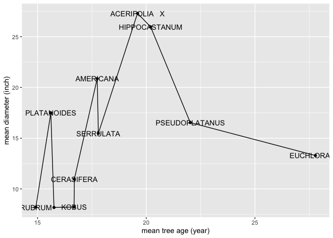

Mini Data-Analysis Deliverable 2
================
Tzu-Yi Lu,
2021 Oct 19

*To complete this milestone, you can either edit [this `.rmd`
file](https://raw.githubusercontent.com/UBC-STAT/stat545.stat.ubc.ca/master/content/mini-project/mini-project-2.Rmd)
directly. Fill in the sections that are commented out with `<!--- start
your work here--->`. When you are done, make sure to knit to an `.md`
file by changing the output in the YAML header to `github_document`,
before submitting a tagged release on canvas.*

# Welcome back to your mini data analysis project\!

This time, we will explore more in depth the concept of *tidy data*, and
hopefully investigate further into your research questions that you
defined in milestone 1.

**NOTE**: The main purpose of the mini data analysis is to integrate
what you learn in class in an analysis. Although each milestone provides
a framework for you to conduct your analysis, it’s possible that you
might find the instructions too rigid for your data set. If this is the
case, you may deviate from the instructions – just make sure you’re
demonstrating a wide range of tools and techniques taught in this class.

Begin by loading your data and the tidyverse package below:

``` r
library(datateachr) # <- might contain the data you picked!
library(tidyverse)
```

# Learning Objectives

By the end of this milestone, you should:

  - Become familiar with manipulating and summarizing your data in
    tibbles using `dplyr` and `tidyr`, with a research question in mind.
  - Understand what *tidy* data is, and how to create it. In milestone
    3, we will explore when this might be useful.
  - Generate a reproducible and clear report using R Markdown.
  - Gain a greater understanding of how to use R to answer research
    questions about your data.

**Things to keep in mind**

  - Remember to document your code, be explicit about what you are
    doing, and write notes in this markdown document when you feel that
    context is required. Create your analysis as if someone else will be
    reading it\! **There will be 2.5 points reserved for
    reproducibility, readability, and repo organization.**

  - Before working on each task, you should always keep in mind the
    specific **research question** that you’re trying to answer.

# Task 1: Process and summarize your data (15 points)

From milestone 1, you should have an idea of the basic structure of your
dataset (e.g. number of rows and columns, class types, etc.). Here, we
will start investigating your data more in-depth using various data
manipulation functions.

### 1.1 (2.5 points)

First, write out the 4 research questions you defined in milestone 1
were. This will guide your work through milestone 2:

<!-------------------------- Start your work below ---------------------------->

1.  *Does different species have different relationships between the
    tree age and diameter?*
2.  *Is there any obvious relationship between the root barriers the
    tree growth (height/diameter/curb)?*
3.  *Are the trees in the same species planted in the same area? What is
    the spatial distribution of different tree species?*
4.  *Is there any spatial trend in the tree height or diameter in
    different areas?*
    <!----------------------------------------------------------------------------->

### 1.2 (10 points)

Now, for each of your four research questions, choose one task from
options 1-4 (summarizing), and one other task from 4-8 (graphing). You
should have 2 tasks done for each research question (8 total). Make sure
it makes sense to do them\! (e.g. don’t use a numerical variables for a
task that needs a categorical variable.). Comment on why each task helps
(or doesn’t\!) answer the corresponding research question.

Ensure that the output of each operation is printed\!

**Summarizing:**

1.  Compute the *range*, *mean*, and *two other summary statistics* of
    **one numerical variable** across the groups of **one categorical
    variable** from your data.
2.  Compute the number of observations for at least one of your
    categorical variables. Do not use the function `table()`\!
3.  Create a categorical variable with 3 or more groups from an existing
    numerical variable. You can use this new variable in the other
    tasks\! *An example: age in years into “child, teen, adult,
    senior”.*
4.  Based on two categorical variables, calculate two summary statistics
    of your choosing.

**Graphing:**

5.  Create a graph out of summarized variables that has at least two
    geom layers.
6.  Create a graph of your choosing, make one of the axes logarithmic,
    and format the axes labels so that they are “pretty” or easier to
    read.
7.  Make a graph where it makes sense to customize the alpha
    transparency.
8.  Create 3 histograms out of summarized variables, with each histogram
    having different sized bins. Pick the “best” one and explain why it
    is the best.

Make sure it’s clear what research question you are doing each operation
for\!

<!------------------------- Start your work below ----------------------------->

**\[Prepare for the dataset\]** → Extract datasets within the chosen
areas (which are near UBC) and name the variable as “**VanTreeUBC**”.

``` r
# (0) Definition of chosen areas
# Answer: Listing all neighborhood names and pick observations in specific areas.
#         Neighborhoods located between UBC and Hwy99 are defined as chosen areas.
all_neighbor <- vancouver_trees %>%
  group_by(neighbourhood_name) %>%
  count()
chosen_area <- c("ARBUTUS-RIDGE","DUNBAR-SOUTHLANDS","KITSILANO","SHAUGHNESSY","WEST POINT GREY")
VanTreeUBC <- filter(vancouver_trees, neighbourhood_name %in% chosen_area) 
VanTreeUBC <- mutate(VanTreeUBC,tree_age = as.numeric(difftime(as.Date("2021-10-09"),VanTreeUBC$date_planted))/365)
```

**(Q1.2.1)**:

Does different species have different relationships between the tree age
and diameter?

**(A1.2.1)**:

I choose question-**1** and question-**5** to understand the
relationship between the tree age and diameter. I used the
“**summarise**” function to know the overall variations of the
diameter and the tree age. Becuase there are too many species, I only
obtain the top 5% in observation amounts of species for the following
analysis. Only 11 out of 219 species stay. By the answer to question-5,
I found inconsistent relationships between the **diameter** and the
**tree age**. For example, the mean tree age of **ACERIFOLIA X**(19.6
years) is smaller than **EUCHLORA X**(27.7 years), but the mean diameter
of **ACERIFOLIA X**(27.3 inches) is larger than **EUCHLORA X**(13.3
inches). Therefore, ***the relationships between diameter and the tree
age differ from species to species***.

``` r
# AnsFor(1) Compute the range, mean, and two other summary statistics of diameter

# Compute the statistics of the "diameter"
Ans1.2.1_d <-VanTreeUBC %>%
  group_by(species_name) %>%
  summarise(across(diameter, .f=list("mean"=mean,"min"=min,"max"=max,"median"=min,"sd"=sd),na.rm=TRUE),n=n()) %>%
  mutate(range = diameter_max-diameter_min) 
# Because there are too many species (totally 219), I only keep the first 5% (totally 11) with respect to observation amounts for the following analysis.
Ans1.2.1_d <- filter(Ans1.2.1_d, n>=quantile(Ans1.2.1_d$n,probs=0.95))
head(Ans1.2.1_d)
```

    ## # A tibble: 6 × 8
    ##   species_name   diameter_mean diameter_min diameter_max diameter_median
    ##   <chr>                  <dbl>        <dbl>        <dbl>           <dbl>
    ## 1 ACERIFOLIA   X         27.3             2           55               2
    ## 2 AMERICANA              20.9             0           55               0
    ## 3 CERASIFERA             11.0             0           78               0
    ## 4 EUCHLORA   X           13.3             1           40               1
    ## 5 HIPPOCASTANUM          26.0             0           64               0
    ## 6 KOBUS                   8.22            0           37               0
    ## # … with 3 more variables: diameter_sd <dbl>, n <int>, range <dbl>

``` r
# Compute the mean tree age across different species, and keep the same species as diameter statistics (i.e. Ans1.2.1_d).
Ans1.2.1_y <-VanTreeUBC %>% 
  group_by(species_name) %>%
  summarise(across(tree_age, mean,na.rm=TRUE)) %>%
  filter(species_name %in% Ans1.2.1_d$species_name)
head(Ans1.2.1_y)
```

    ## # A tibble: 6 × 2
    ##   species_name   tree_age
    ##   <chr>             <dbl>
    ## 1 ACERIFOLIA   X     19.6
    ## 2 AMERICANA          17.7
    ## 3 CERASIFERA         16.7
    ## 4 EUCHLORA   X       27.8
    ## 5 HIPPOCASTANUM      20.2
    ## 6 KOBUS              16.7

``` r
# AnsFor(5) Create a graph out of summarized variables that has at least two geom layers.
# I plot tree_age (x-axis) against diameter_max (y-axis).
ggplot(data=data.frame(x=Ans1.2.1_y$tree_age, y=Ans1.2.1_d$diameter_mean),aes(x=x,y=y,label=Ans1.2.1_y$species_name))+
  geom_point()+geom_line()+geom_text(check_overlap = TRUE)+
  xlab("mean tree age of each species (year)")+ylab("mean diameter (inch)")
```

<!-- -->

``` r
# Tree age
print(format(round(Ans1.2.1_y$tree_age, 1), nsmall = 1))
```

    ##  [1] "19.6" "17.7" "16.7" "27.8" "20.2" "16.7" "15.6" "22.0" "14.9" "17.8"
    ## [11] "15.8"

``` r
# Mean diameter
print(format(round(Ans1.2.1_d$diameter_mean, 1), nsmall = 1))
```

    ##  [1] "27.3" "20.9" "11.0" "13.3" "26.0" " 8.2" "17.5" "16.5" " 8.2" "15.5"
    ## [11] " 8.2"

``` r
# Divide a new data.frame only with the chosen 11 species. I will use it for the following analysis.
VanTreeUBC_chosen<- VanTreeUBC %>%
  filter(species_name %in% Ans1.2.1_d$species_name)
```

**(Q1.2.2)**:

Is there any obvious relationship between the root barriers the diameter
of trees?

**(A1.2.2)**:

I choose question-**2** and question-**5** to show the relationship
between the root barriers and the tree diameter. According to the answer
to question-2 (Ans1.2.2), I found that most trees grew up without root
barriers. Then, I further checked the diameter variations under two
different conditions (with/without root barriers). Then, the trees
growing up with root barriers have smaller diameters than those without
root barriers according to the boxplots except **HIPPOCASTANUM**.
Therefore, root barriers might be a factor that influences tree growth.

``` r
# AnsFor(2) Compute the number of observations for at least one of your categorical variables

# Try to count the total numbers of two categories in "root barriers" from each species. 
Ans1.2.2 <- VanTreeUBC_chosen %>%
  group_by(species_name, root_barrier) %>%
  summarise(num=n()) %>%
  pivot_wider(names_from = root_barrier, values_from=num)
```

    ## `summarise()` has grouped output by 'species_name'. You can override using the `.groups` argument.

``` r
# Try to calculate the proportions of each category
Ans1.2.2 <- replace(Ans1.2.2,is.na(Ans1.2.2),0) %>%
  mutate(total = N+Y) %>%
  mutate(Ratio_N_perc = N/total) %>%
  mutate(Ratio_Y_perc = Y/total) 
  
# Then, the result reveals that most observations are classified as "No root barrier".
head(Ans1.2.2)
```

    ## # A tibble: 6 × 6
    ## # Groups:   species_name [6]
    ##   species_name       N     Y total Ratio_N_perc Ratio_Y_perc
    ##   <chr>          <int> <int> <int>        <dbl>        <dbl>
    ## 1 ACERIFOLIA   X   776     3   779        0.996      0.00385
    ## 2 AMERICANA       1867    43  1910        0.977      0.0225 
    ## 3 CERASIFERA      3370    50  3420        0.985      0.0146 
    ## 4 EUCHLORA   X     722     0   722        1          0      
    ## 5 HIPPOCASTANUM   1140     3  1143        0.997      0.00262
    ## 6 KOBUS            658    14   672        0.979      0.0208

``` r
# AnsFor(5) Create a graph out of summarized variables that has at least two geom layers.
# Choose geom_jitter & geom_bloxplot to demonstrate the data
ggplot(VanTreeUBC_chosen,aes(y=species_name,x=diameter,colour=root_barrier))+
  geom_jitter(alpha=0.5, width=0.2,size=0.2)+
  geom_boxplot(alpha=0.8)
```

<!-- -->
**(Q1.2.3)**:

Are the trees in the same species planted in the same area? What is the
spatial distribution of different tree species?

**(A1.2.3)**:

I choose question-**2** and question-**7** to investigate the spatial
characteristics of trees. The answer to question-2 indicates the amounts
of each species in every neighborhood. Based on the plot for question-7,
some regional distributions can be found. For example, there are more
**CERASIFERA** planted in the northern part of “**ARBUTUS-RIDGE**”, and
it might be hard to find “EUCHLORA X”, “HIPPOCASTANUM”, and
“PSEUDOPLATANUS” in this area. To sum up, trees are planted across
different areas but a little bit unevenly. Among all species,
“AMERICANA”, “CERASIFERA”, “PLATANOIDES”, and “SERRULATA” are
relatively common tree species nearing UBC at Vancouver.

``` r
# worksheet_a03:Q2.5 count tree num. (x) neighborhood name (y) species name
# know the aggregation
Ans1.2.3 <- VanTreeUBC_chosen %>%
  group_by(species_name, neighbourhood_name) %>%
  summarise(num=n()) %>%
  pivot_wider(names_from = neighbourhood_name, values_from=num)
```

    ## `summarise()` has grouped output by 'species_name'. You can override using the `.groups` argument.

``` r
# Plot the distributions of trees and divide them into subplots according to species names.
# Set the transparency as 0.4, and the point size as 0.7.
ggplot(VanTreeUBC_chosen,aes(longitude,latitude,colour=neighbourhood_name))+
  geom_point(alpha=0.4,size=0.5,na.rm=TRUE)+
  xlab("Longitude (deg)")+ylab("Latitude (deg)")+
  scale_color_brewer(palette="Set1")+
  facet_wrap(~species_name)+ theme(legend.position = c(0.9, 0.1),legend.text = element_text(size=8))
```

<!-- -->

**(Q1.2.4)**:

Is there any spatial trend in the tree diameter in different species?

**(A1.2.4)**:

I choose question-**3** and question-**7** to understand the spatial
characteristics of diameter. I choose four common tree species according
to the answer to Q1.2.3 because abundant observations is useful when
concluding trends. I classify trees into four levels based on the
diameter measurements, including small, medium, large, and extra-large.
I plot data points on the map and mark the points with different colors
according to their diameter levels. I found trees with larger diameters
located in the boundary of the points in the “AMERICANA” section, and
those with smaller diameters located in the center of the points in the
“SERRULATA” section. However, the spatial characteristics are not
obvious in all subplots.

``` r
# Use only four common species:"AMERICANA", "CERASIFERA", "PLATANOIDES", and "SERRULATA"
# Divide diameter into 4 classes: 1_Small, 2_Median, 3_Large, and 4_ExtraLarge
Ans1.2.4 <- VanTreeUBC_chosen %>%
  filter(species_name %in% c("AMERICANA", "CERASIFERA", "PLATANOIDES", "SERRULATA")) %>%
  mutate(diameter_level = case_when(diameter<10 ~ "1_Small",
                                    diameter<30 ~ "2_medium",
                                    diameter<50 ~ "3_Large",
                                    TRUE ~ "4_Extra-Large"))

# Plot the spatial distributions of the four common species with four diameter levels.
ggplot(Ans1.2.4,aes(longitude,latitude,colour=diameter_level))+
  geom_point(alpha=0.9,size=1.1,na.rm=TRUE)+
  xlab("Longitude (deg)")+ylab("Latitude (deg)")+
  scale_color_brewer(palette="GnBu")+
  facet_wrap(~species_name)
```

<!-- -->

<!----------------------------------------------------------------------------->

### 1.3 (2.5 points)

Based on the operations that you’ve completed, how much closer are you
to answering your research questions? Think about what aspects of your
research questions remain unclear. Can your research questions be
refined, now that you’ve investigated your data a bit more? Which
research questions are yielding interesting results?

<!------------------------- Write your answer here ---------------------------->

**(A1.3)**:

According to the results shown above, I found that there is no specific
spatial distribution in tree species. Maybe I should modify my research
questions to investigate the relationship between species and tree
growth variables (height/diameter/curb/tree age). In my opinion, the
result of Q1.2.1 is interesting. This plot implies that species might be
a critical factor regarding the relationship between mean diameter and
mean tree age. That is worth being further studied.

<!----------------------------------------------------------------------------->

# Task 2: Tidy your data (12.5 points)

In this task, we will do several exercises to reshape our data. The goal
here is to understand how to do this reshaping with the `tidyr` package.

A reminder of the definition of *tidy* data:

  - Each row is an **observation**
  - Each column is a **variable**
  - Each cell is a **value**

*Tidy’ing* data is sometimes necessary because it can simplify
computation. Other times it can be nice to organize data so that it can
be easier to understand when read manually.

### 2.1 (2.5 points)

Based on the definition above, can you identify if your data is tidy or
untidy? Go through all your columns, or if you have \>8 variables, just
pick 8, and explain whether the data is untidy or tidy.

<!--------------------------- Start your work below --------------------------->

**(A2.1)**:

There are 21 variables in my dataset (VanTreeUBC\_chosen). I choose
“tree\_id”,
“genus\_name”,“species\_name”,“root\_barrier”,“neighbourhood\_name”,“height\_range\_id”,“diameter”,“curb”.

“tree\_id”: Each row is an **observation**, Each column is a
**variable**, and Each cell is a **numeric value**. “genus\_name”: Each
row is an **observation**, Each column is a **variable**, and Each cell
is a **string value**. “species\_name”: Each row is an **observation**,
Each column is a **variable**, and Each cell is a **string value**.
“root\_barrier”: Each row is an **observation**, Each column is a
**variable**, and Each cell is a **categorical value** including
“Y”/“N”. “neighbourhood\_name”: Each row is an **observation**,
Each column is a **variable**, and Each cell is a **categorical value**
including 5 neighborhoods. “height\_range\_id”: Each row is an
**observation**, Each column is a **variable**, and Each cell is a
**categorical value** including 10 categorical levels “diameter”: Each
row is an **observation**, Each column is a **variable**, and Each cell
is a **numeric value**. “curb”: Each row is an **observation**, Each
column is a **variable**, and Each cell is a **categorical value**
including “Y”/“N”.

``` r
# Show the first 6 rows of "VanTreeUBC_chosen".
head(VanTreeUBC_chosen)
```

    ## # A tibble: 6 × 21
    ##   tree_id civic_number std_street   genus_name species_name cultivar_name
    ##     <dbl>        <dbl> <chr>        <chr>      <chr>        <chr>        
    ## 1  155373         1900 CYPRESS ST   PRUNUS     CERASIFERA   NIGRA        
    ## 2  155413         2485 W BROADWAY   ULMUS      AMERICANA    BRANDON      
    ## 3  155436         3039 COURTENAY ST MAGNOLIA   KOBUS        <NA>         
    ## 4  155446         2246 W 15TH AV    ACER       RUBRUM       KARPICK      
    ## 5  156061         2659 W 19TH AV    FRAXINUS   AMERICANA    <NA>         
    ## 6  156242         3638 HUDSON ST    ACER       PLATANOIDES  <NA>         
    ## # … with 15 more variables: common_name <chr>, assigned <chr>,
    ## #   root_barrier <chr>, plant_area <chr>, on_street_block <dbl>,
    ## #   on_street <chr>, neighbourhood_name <chr>, street_side_name <chr>,
    ## #   height_range_id <dbl>, diameter <dbl>, curb <chr>, date_planted <date>,
    ## #   longitude <dbl>, latitude <dbl>, tree_age <dbl>

<!----------------------------------------------------------------------------->

### 2.2 (5 points)

Now, if your data is tidy, untidy it\! Then, tidy it back to it’s
original state.

If your data is untidy, then tidy it\! Then, untidy it back to it’s
original state.

Be sure to explain your reasoning for this task. Show us the “before”
and “after”.

<!--------------------------- Start your work below --------------------------->

**(A2.2)**: Because VanTreeUBC\_chosen is a tidy dataset, I will untidy
it.

``` r
# Demonstrate the dataset
print(VanTreeUBC_chosen, n=5)
```

    ## # A tibble: 18,672 × 21
    ##   tree_id civic_number std_street   genus_name species_name cultivar_name
    ##     <dbl>        <dbl> <chr>        <chr>      <chr>        <chr>        
    ## 1  155373         1900 CYPRESS ST   PRUNUS     CERASIFERA   NIGRA        
    ## 2  155413         2485 W BROADWAY   ULMUS      AMERICANA    BRANDON      
    ## 3  155436         3039 COURTENAY ST MAGNOLIA   KOBUS        <NA>         
    ## 4  155446         2246 W 15TH AV    ACER       RUBRUM       KARPICK      
    ## 5  156061         2659 W 19TH AV    FRAXINUS   AMERICANA    <NA>         
    ## # … with 18,667 more rows, and 15 more variables: common_name <chr>,
    ## #   assigned <chr>, root_barrier <chr>, plant_area <chr>,
    ## #   on_street_block <dbl>, on_street <chr>, neighbourhood_name <chr>,
    ## #   street_side_name <chr>, height_range_id <dbl>, diameter <dbl>, curb <chr>,
    ## #   date_planted <date>, longitude <dbl>, latitude <dbl>, tree_age <dbl>

``` r
# Considering the original dataset is not suitable for this task, I simplify the dataset into a smaller matrix.
VanTreeUBC_chosen_2 <- VanTreeUBC_chosen %>%
  group_by(species_name,neighbourhood_name) %>%
  summarize(num=n())
```

    ## `summarise()` has grouped output by 'species_name'. You can override using the `.groups` argument.

``` r
# Before untidying:
print(VanTreeUBC_chosen_2, n=5)
```

    ## # A tibble: 55 × 3
    ## # Groups:   species_name [11]
    ##   species_name   neighbourhood_name   num
    ##   <chr>          <chr>              <int>
    ## 1 ACERIFOLIA   X ARBUTUS-RIDGE        103
    ## 2 ACERIFOLIA   X DUNBAR-SOUTHLANDS    168
    ## 3 ACERIFOLIA   X KITSILANO            141
    ## 4 ACERIFOLIA   X SHAUGHNESSY          238
    ## 5 ACERIFOLIA   X WEST POINT GREY      129
    ## # … with 50 more rows

``` r
# Try to untidy the dataset
A2.2.1 <- pivot_wider(VanTreeUBC_chosen_2, id_cols = species_name, names_from = neighbourhood_name , values_from = num)

# After untidying:
print(A2.2.1, n=5)
```

    ## # A tibble: 11 × 6
    ## # Groups:   species_name [11]
    ##   species_name   `ARBUTUS-RIDGE` `DUNBAR-SOUTHLANDS` KITSILANO SHAUGHNESSY
    ##   <chr>                    <int>               <int>     <int>       <int>
    ## 1 ACERIFOLIA   X             103                 168       141         238
    ## 2 AMERICANA                  225                 435       260         780
    ## 3 CERASIFERA                 895                1061       435         632
    ## 4 EUCHLORA   X                55                  78       432          72
    ## 5 HIPPOCASTANUM              125                 274       277         311
    ## # … with 6 more rows, and 1 more variable: WEST POINT GREY <int>

``` r
# Try to tidy the dataset
A2.2.2 <- pivot_longer(A2.2.1, c("ARBUTUS-RIDGE","DUNBAR-SOUTHLANDS","KITSILANO","SHAUGHNESSY","WEST POINT GREY"), names_to = "neighbourhood_name", values_to = "num")

# Dataset check after tidying:
print(A2.2.2, n=5)
```

    ## # A tibble: 55 × 3
    ## # Groups:   species_name [11]
    ##   species_name   neighbourhood_name   num
    ##   <chr>          <chr>              <int>
    ## 1 ACERIFOLIA   X ARBUTUS-RIDGE        103
    ## 2 ACERIFOLIA   X DUNBAR-SOUTHLANDS    168
    ## 3 ACERIFOLIA   X KITSILANO            141
    ## 4 ACERIFOLIA   X SHAUGHNESSY          238
    ## 5 ACERIFOLIA   X WEST POINT GREY      129
    ## # … with 50 more rows

``` r
# check whether the dataset is back to original state.
identical(A2.2.2,VanTreeUBC_chosen_2)
```

    ## [1] TRUE

<!----------------------------------------------------------------------------->

### 2.3 (5 points)

Now, you should be more familiar with your data, and also have made
progress in answering your research questions. Based on your interest,
and your analyses, pick 2 of the 4 research questions to continue your
analysis in milestone 3, and explain your decision.

Try to choose a version of your data that you think will be appropriate
to answer these 2 questions in milestone 3. Use between 4 and 8
functions that we’ve covered so far (i.e. by filtering, cleaning,
tidy’ing, dropping irrelvant columns, etc.).

<!--------------------------- Start your work below --------------------------->

<!----------------------------------------------------------------------------->

*When you are done, knit an `md` file. This is what we will mark\! Make
sure to open it and check that everything has knitted correctly before
submitting your tagged release.*

### Attribution

Thanks to Victor Yuan for mostly putting this together.
